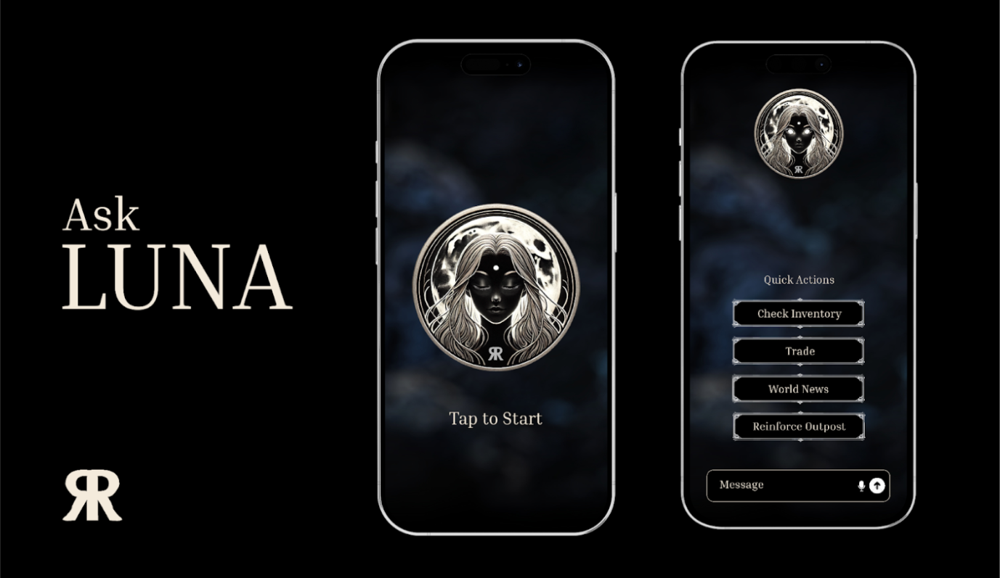

# Luna - Rising Revenant AI Advisor 🤖

<div align="center">
  
</div>

> Built by [AndyTanuC](https://github.com/AndyTanuC/Luna), powered by [Eliza](https://github.com/elizaos/eliza) - an open source AI agent framework

## 🚩 Overview

Luna is an AI advisor specifically crafted for Rising Revenant, providing strategic guidance and tactical advice while maintaining the game's gothic atmosphere. She helps players navigate the complex world of Rising Revenant with personalized strategies and deep game knowledge.

## ✨ Features

- 🎮 Deep Rising Revenant expertise
- 🛡️ Strategic battlefield analysis
- 🏰 Outpost defense optimization
- 📚 Comprehensive game mechanics knowledge
- 🎭 Gothic and mysterious personality
- 🔮 Real-time tactical suggestions
- 🎯 Event attack preparation guidance

## Video Demo

[Luna Demo](https://youtube.com/shorts/YDu5iijEgvY)

## 🎮 Use Cases

- Strategic gameplay planning
- Outpost defense optimization
- Event attack preparation
- Resource management
- Game mechanics explanation
- Lore exploration and storytelling

## 🚀 Quick Start

### Prerequisites

- [Python 2.7+](https://www.python.org/downloads/)
- [Node.js 23+](https://docs.npmjs.com/downloading-and-installing-node-js-and-npm)
- [pnpm](https://pnpm.io/installation)

> **Note for Windows Users:** [WSL 2](https://learn.microsoft.com/en-us/windows/wsl/install) is required.

### Installation

```bash
git clone https://github.com/AndyTanuC/Luna.git
cd Luna
cp .env.example .env
pnpm i && pnpm build && pnpm start
```

For luna to work, make sure you have set the following environment variables:

- TORII_URL
- STARKNET_PROVIDER_URL
- STARKNET_CONTRACT_ADDRESS
- STARKNET_OUTPOST_ADDRESS
- STARKNET_REINFORCEMENT_ADDRESS
- STARKNET_MARKET_ADDRESS

Once Luna is running, open another terminal in the same directory and run:

```bash
pnpm start:client
```

Follow the URL provided to start chatting with Luna about Rising Revenant strategies.

You also need one of these crypto wallets extensions to play the game:

- [Braavos](https://braavos.app/)
- [Argent X](https://www.argent.xyz/)

We are planning to support [cartridge](https://cartridge.gg/) as well in the future.

## Credits

This project is built on top of [Eliza](https://github.com/elizaos/eliza), an open source AI agent framework. Special thanks to:

- The Eliza team for providing the foundation
- The Rising Revenant community for their support and feedback
- All contributors who help improve Luna

## License

MIT License - see [LICENSE](LICENSE) for details
